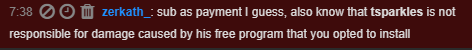
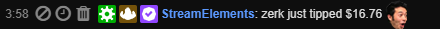

# sly1-hack

welcome to my sly 1 hack

1. compile dll
2. inject (into pcsx2)
3. profit

## Contributions
I would love contributions on this project. If you have any ideas, join the [Sly Modding Discord](https://discord.gg/J7d7UAy), or [United Effort](https://discord.gg/HtREYrf). If I'm not happy with your code I will still gladly take it and ffix it

## How to use this dll

1. Start the dll injector
2. type "pcsx" and press enter
3. type "sly" and press enter

then you wait on the ready screen

* start your game
* while the game is loading in, inject (aka press enter one more time on the injector)
* **this has to be done before paris loads in**

Now that you are ready, here's how the menu works:

**Page Down**: Opens/Closes the menu  
**Up/Down arrows**: navigate the menu / go up or down, respectively, in noclip (requires the menu to be closed)  
**Left arrow**: go back in the menu  

Tips for noclip: jump before you enable it. this way you will be able to control your velocity with your joystick.

_The hooks work this way_:  
The first time that an event happens in the game that is tied to the hooks, it will replace the code with the custom code.  
This usually means that the first time you do the event, the custom code won't actually execute.  

Godmode also only works for specific guards atm, because the animations are different for some enemies.
